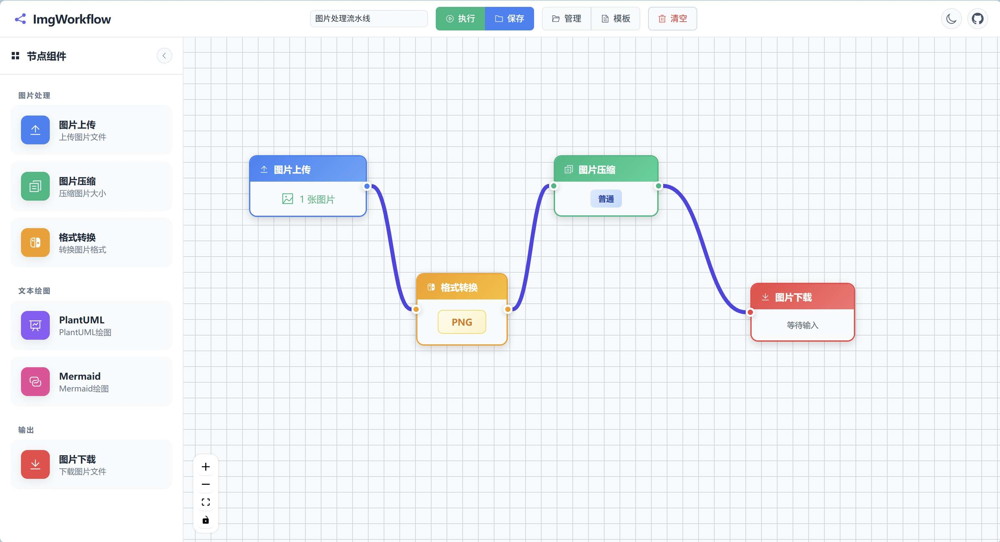
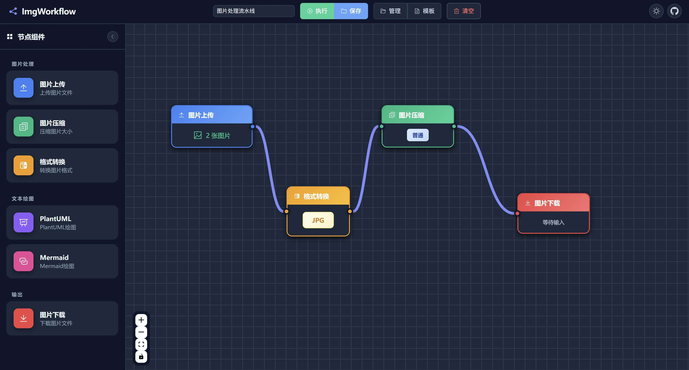

<p align="center">
  <a href="README.md">中文</a> | <a href="README_EN.md">English</a>
</p>

<p align="center">
  
</p>

<h1 align="center">ImgWorkflow</h1>

<p align="center">
  <strong>Visual Image Processing Workflow Editor</strong>
</p>

<p align="center">
  A Vue 3-based drag-and-drop image processing workflow editor with multiple image operations and text diagramming features
</p>

<p align="center">
  <a href="http://hrhcode.com:5175/" target="_blank">🌐 Live Demo</a> •
  <a href="#features">Features</a> •
  <a href="#screenshots">Screenshots</a> •
  <a href="#quick-start">Quick Start</a> •
  <a href="#usage">Usage</a> •
  <a href="#tech-stack">Tech Stack</a>
</p>

---

## Features

### 📷 Image Processing Nodes

| Node                  | Description                                                                                     |
| --------------------- | ----------------------------------------------------------------------------------------------- |
| **Image Upload**      | Batch upload image files, supports JPG, PNG, WebP, GIF, BMP, AVIF formats                       |
| **Image Compression** | Adjustable compression quality and size limits, preset compression levels and custom parameters |
| **Format Conversion** | Convert between PNG, JPG, WebP, GIF, BMP, AVIF formats with adjustable output quality           |
| **Image Download**    | Single file download or ZIP package download with customizable file prefix                      |

### 📊 Text Diagram Nodes

| Node         | Description                                                                                      |
| ------------ | ------------------------------------------------------------------------------------------------ |
| **Mermaid**  | Create flowcharts, sequence diagrams, Gantt charts using Mermaid syntax, supports PNG/SVG output |
| **PlantUML** | Create UML diagrams using PlantUML syntax, supports PNG/SVG output                               |

### 🔧 Workflow Features

- ✅ **Visual Drag-and-Drop Editing** - Intuitive node dragging and connection operations
- ✅ **Node Connection & Data Flow** - Clear data flow direction with single-branch connections
- ✅ **Workflow Save & Load** - Local storage of workflow configurations
- ✅ **Preset Templates** - Built-in common workflow templates for quick start
- ✅ **Execution Progress Display** - Real-time workflow execution progress
- ✅ **Execution Termination** - Stop running workflows at any time
- ✅ **Light/Dark Theme** - Support for both light and dark themes

---

## Screenshots

### Light Theme



### Dark Theme



---

## Quick Start

### Requirements

- Node.js >= 16.0.0
- npm >= 7.0.0

### Install Dependencies

```bash
npm install
```

### Development Mode

```bash
npm run dev
```

Visit http://localhost:5175 to view the application

### Build for Production

```bash
npm run build
```

### Preview Production Build

```bash
npm run preview
```

---

## Usage

### Creating a Workflow

1. **Drag nodes** from the left panel to the canvas
2. Click on a node's connection point and **drag to another node** to establish a connection
3. **Click on a node** to configure parameters in the right panel
4. Click the **"Execute" button** to run the workflow

### Node Connection Rules

- Each node has an input port (left) and an output port (right)
- Data flows from left to right
- One output can only connect to one input (single-branch connection)
- One input can only accept one output
- Circular connections are not allowed

### Workflow Templates

The system provides the following preset templates for quick start:

| Template Name              | Description                                                            |
| -------------------------- | ---------------------------------------------------------------------- |
| Image Processing Pipeline  | Complete image processing flow: Upload → Convert → Compress → Download |
| Image Compression Download | Upload images, compress and download                                   |
| Format Conversion Download | Upload images, convert format and download                             |
| PlantUML Diagram Download  | Create diagrams using PlantUML syntax and download                     |
| Mermaid Diagram Download   | Create diagrams using Mermaid syntax and download                      |

### Keyboard Shortcuts

| Shortcut               | Function             |
| ---------------------- | -------------------- |
| `Delete` / `Backspace` | Delete selected node |

---

## Tech Stack

| Category               | Technology                |
| ---------------------- | ------------------------- |
| **Frontend Framework** | Vue 3 + Composition API   |
| **State Management**   | Pinia                     |
| **UI Components**      | Element Plus              |
| **Flowchart Editor**   | Vue Flow                  |
| **Build Tool**         | Vite                      |
| **Image Compression**  | browser-image-compression |
| **Diagram Rendering**  | Mermaid, PlantUML         |
| **File Packaging**     | JSZip                     |
| **Local Storage**      | IndexedDB (idb)           |

---

## Project Structure

```
imgworkflow/
├── public/
│   ├── favicon.svg          # Website icon
│   ├── screenshot-light.jpg # Light theme screenshot
│   └── screenshot-dark.jpg  # Dark theme screenshot
├── src/
│   ├── assets/
│   │   └── styles/          # Global styles
│   ├── components/
│   │   ├── nodes/           # Node components
│   │   │   └── config/      # Node config panels
│   │   ├── TemplatePanel.vue
│   │   └── WorkflowManager.vue
│   ├── router/              # Router configuration
│   ├── services/            # Service layer
│   │   ├── compressService.js
│   │   ├── convertService.js
│   │   ├── downloadService.js
│   │   ├── mermaidService.js
│   │   ├── plantumlService.js
│   │   └── storageService.js
│   ├── stores/              # State management
│   │   ├── theme.js
│   │   └── workflow.js
│   ├── views/
│   │   └── WorkflowEditor.vue
│   ├── App.vue
│   └── main.js
├── index.html
├── package.json
├── vite.config.js
├── README.md
└── README_EN.md
```

---

## Browser Support

| Browser | Support        |
| ------- | -------------- |
| Chrome  | ✅ Recommended |
| Firefox | ✅ Supported   |
| Safari  | ✅ Supported   |
| Edge    | ✅ Supported   |

---

## License

[MIT License](LICENSE)

---

## Acknowledgments

- [Vue.js](https://vuejs.org/) - The Progressive JavaScript Framework
- [Element Plus](https://element-plus.org/) - Vue 3 Component Library
- [Vue Flow](https://vueflow.dev/) - Vue 3 Flowchart Library
- [Mermaid](https://mermaid.js.org/) - JavaScript Diagramming Library
- [PlantUML](https://plantuml.com/) - UML Diagram Tool
